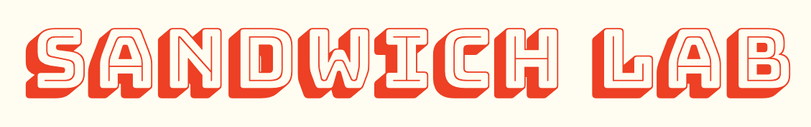
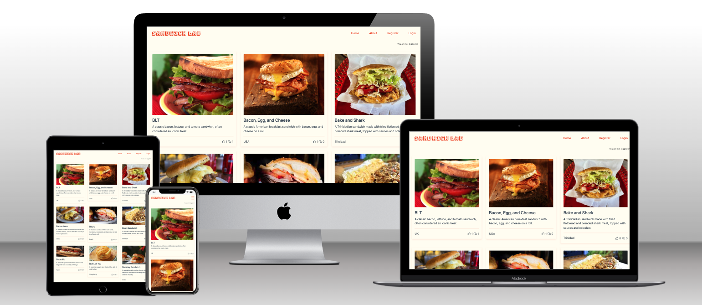
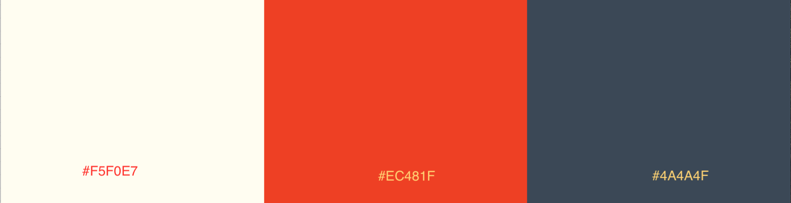
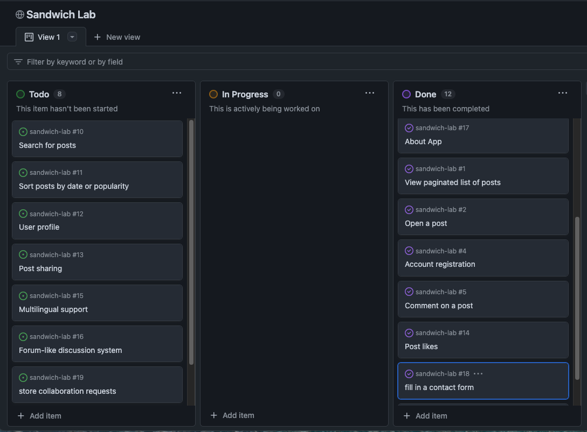

Hey there! Welcome to Sandwich Lab, where we dive into the delicious world of sandwiches. I’m Fabio, a coding enthusiast with a serious passion for culinary adventures. Growing up in Porto, one sandwich always stole the spotlight for me—the Francesinha.

This project is part of my journey in the Code Institute’s Full-Stack Developer course, where I’m focusing on:

- Mastering the Django framework

- Integrating PostgreSQL databases

- Implementing essential CRUD functionalities

So come along and join me as I blend my love for sandwiches and coding, one tasty line at a time!

### Sandwich Lab Homepage

- **Live site**: [Sandwich Lab](https://sandwich-lab-7fc0ba3ca59c.herokuapp.com/)
- **GitHub repository**: [Sandwich Lab GitHub](https://github.com/fabiowxavier/sandwich-lab)

---

## Table of Contents

- [Introduction](#introduction)
- [Overview](#overview)
- [UX - User Experience](#ux---user-experience)
  - [Design Inspiration](#design-inspiration)
  - [Colour Scheme](#colour-scheme)
  - [Font](#font)
- [Project Planning](#project-planning)
  - [Strategy Plane](#strategy-plane)
  - [Site Goals](#site-goals)
  - [Agile Methodologies](#agile-methodologies---project-management)
  - [MoSCoW Prioritization](#moscow-prioritization)
  - [Sprints](#sprints)
  - [User Stories](#user-stories)
  - [Scope Plane](#scope-plane)
  - [Wireframes](#wireframes)
- [Database Schema - ERD](#database-schema---entity-relationship-diagram)
- [Security](#security)
- [Features](#features)
  - [User View - Registered/Unregistered](#user-view---registeredunregistered)
  - [Role-Based Dashboard Features](#role-based-dashboard-features)
  - [Appointment Booking System](#appointment-booking-system)
  - [Messaging System](#messaging-system)
- [Technologies & Languages Used](#technologies--languages-used)
  - [Libraries & Frameworks](#libraries--frameworks)
  - [Tools & Programs](#tools--programs)
- [Testing](#testing)
- [Bugs](#bugs)
- [Deployment](#deployment)
  - [Connecting to GitHub](#connecting-to-github)
  - [Django Project Setup](#django-project-setup)
  - [Heroku Deployment](#heroku-deployment)
- [Privacy Policy](#privacy-policy)
- [Credits](#credits)
- [Acknowledgements](#acknowledgements)

---

## Overview

Sandwich Lab is a platform that allows users to:

- Browse a variety of mouth-watering sandwiches
- Like their favorite sandwiches and see what other users liked
- Leave Comments on different sandwiches
- Check Out what others are saying in their comments

This platform is designed to bring together people who love sandwiches and want to share their creations with the world.

---

## UX - User Experience

### Design Inspiration
The design of **Sandwich Lab** springs from my deep love for the Francesinha and the joy it brings me to share this culinary gem with others. Inspired by the rich flavors and cultural heritage of this iconic sandwich, I envisioned a space where fellow sandwich enthusiasts could explore, discover sandwiches from around the world.

### Colour Scheme
- **Primary Color**: #EC481F
- **Secondary Color**: #4A4A4F;
- **Accent Color**: #EC481F
- **Background**: #F5F0E7 

This combination ensures a vibrant yet clean appearance, matching the food-related theme of the website.

### Font
- **Logo**: Bungee Shade
- **Body Text & Interactive Elements & Headers**: Helvetica Neue

---

## Project Planning

### Strategy Plane
The primary goal of **Sandwich Lab** s to offer a user-friendly platform for sandwich enthusiasts to discover new sandwiches from around the world. This project aims to share the hidden sandwich gems from every corner of the globe, bringing together a diverse array of flavors and traditions. By creating a space that highlights these unique and delicious sandwiches, we hope to inspire and connect sandwich lovers everywhere.

### Site Goals

#### User Engagement

- Create an intuitive and enjoyable user experience that encourages sandwich enthusiasts to explore and interact with the site.

- Implement features like comments, likes, and sharing options to boost user interaction.

####  Discoverability

- Provide a comprehensive and easily navigable database of sandwiches from around the world.

#### Community Building

- Encourage users to leave comments and reviews, creating a lively exchange of ideas and tips.

#### Educational Content

- Offer detailed descriptions, histories, and recipes for each sandwich to educate users about different cultures and culinary traditions.

#### Visual Appeal

- Ensure the site is visually appealing with high-quality images and a clean, modern design.

Use design elements that reflect the diverse and vibrant nature of sandwiches from different parts of the world.

#### Accessibility

- Make the website accessible to all users, including those with disabilities.

- Follow best practices for web accessibility to ensure everyone can enjoy the content.

Mobile Optimization:

- Optimize the site for mobile devices to ensure a seamless experience for users on the go.

- Ensure that all features are fully functional and visually appealing on smaller screens.

### Agile Methodologies - Project Management
The project was managed using agile methodologies, breaking down the development process into sprints. Tasks were tracked using GitHub’s project board and issues.

### MoSCoW Prioritization
- **Must-Haves**: User registration and login, posts commenting and like
- **Should-Haves**: Sandwich recipe search functionality, post sharing, improved UI/UX.
- **Could-Haves**: User-generated images for sandwiches, forum like discussion system.
- **Won’t-Haves**: Full payment integration.

### Sprints
1. **Sprint 1**: Set up Django project and environment.
2. **Sprint 2**: User authentication and profile creation.
3. **Sprint 3**: Sandwich blog post creation and comment functionality.
4. **Sprint 4**: UI/UX improvements and search functionality.
5. **Sprint 5**: Deployment and final testing.

### User Stories
- As a **user**, I want to view a paginated list of posts so that I can select which post I want to view.
- As a **user**, I want to click on a post so that I can read the full text.
- As a **user**, I want to view comments on an individual post so that I can read the conversation.
- As a **user**, I want to register an account so that I can comment on a post.
- As a **user**, I want to leave comments on a post so that I can be involved in the conversation.
- As a **user**, I want to modify or delete my comment on a post so that I can be involved in the blog posts
- As a **user**, I want to leave comments and likes for sandwiches.
- As a **user**, I want to fill in a contact form so that I can submit a request for collaboration.
- As an **admin**, I want to approve or disapprove comments so that I can filter out objectionable comments.
- As an **admin**, I want to create draft posts so that I can finish writing the content later.

### Scope Plane
The **Sandwich Lab** platform is designed with essential functionalities to ensure a great user experience. The MVP includes:

#### User Registration and Login

- Users can create an account and log in to access personalized features.

#### Sandwich Details Viewing and Rating

- Users can browse detailed information about various sandwiches.

- Rate sandwiches to share their opinions and help others discover the best ones.

#### CRUD Operations for Sandwich Blog Posts

- Users can create, read, update, and delete blog posts comment about their sandwich experiences and recipes.

### Wireframes
Wireframes were created for the following pages:
- **Home Page**: Displays a paginated view of featured sandwiches, making it easy for users to browse through a curated selection of sandwich delights.
- **Sandwich Detail Page**: View detailed information about each sandwich recipe.
- **Admin Panel**: Admins can manage users and sandwich submissions.

Wireframes were designed using **Balsamiq** to ensure usability and clarity.

---

## Database Schema - ERD

The **Entity Relationship Diagram (ERD)** shows the relationships between **users**, **sandwiches**, and **reviews**. This is important to visualize how different data points interact within the PostgreSQL database.

---

## Security
The platform uses Django’s built-in security features to handle user authentication securely, and ensure that sensitive data is protected.

---

## Features

### User View - Registered/Unregistered
**Unregistered users** can view sandwich recipes and browse the platform. **Registered users** have full access to create, edit, and delete their recipes and reviews.

### Role-Based Dashboard Features
- **User Dashboard**: View and manage submitted sandwich recipes, ratings, and reviews.
- **Admin Dashboard**: Manage users and their submitted sandwiches.

### Profile Management
Users can view and edit their profiles, including their sandwich recipes and reviews.

---

## Technologies & Languages Used

### Libraries & Frameworks
- **Django**: Backend framework
- **PostgreSQL**: Database management system
- **Cloudinary**: For media storage
- **Whitenoise**: For static file management

### Tools & Programs
- **GitHub**: Version control and project management
- **Heroku**: Deployment and hosting
- **Balsamiq**: Wireframes

---

## Testing

### Validation Testing
- **HTML**: W3C HTML Validator.
- **CSS**: W3C CSS Validator.
- **Python**: PEP8 validation.

### User Testing
- **Browser Compatibility**: Tested across Chrome, Firefox, Safari, and Edge.
- **Responsiveness**: Ensured that the site works on mobile, tablet, and desktop.

---

## Deployment

### Connecting to GitHub
The project was connected to GitHub for version control and was deployed using Heroku. The necessary steps for deployment include configuring the `Procfile`, setting up environment variables, and using Git for version control.

### Heroku Deployment
- Deployed to Heroku by connecting the GitHub repository and configuring necessary environment variables such as `DATABASE_URL`, `CLOUDINARY_URL`, and `SECRET_KEY`.

---

## Privacy Policy
As part of this project, user data such as registration details and sandwich submissions are securely stored, with role-based access ensuring the privacy of personal information. The platform does not share personal data with third parties.

---

## Credits

### Code
- Django Documentation
- ChatGPT AI for code ideas and implementation suggestions
- Favicon.io for favicon generation
- Google Fonts for typography

### Media
- Icons and images from **Canva** and **ChatGPT**

---

## Acknowledgements
Special thanks to **Amy Richardson** and **Mark Brisco** for their mentorship, guidance, and valuable feedback throughout this project. Also, thanks to **Code Institute** for providing the resources and environment to complete the project.

---
