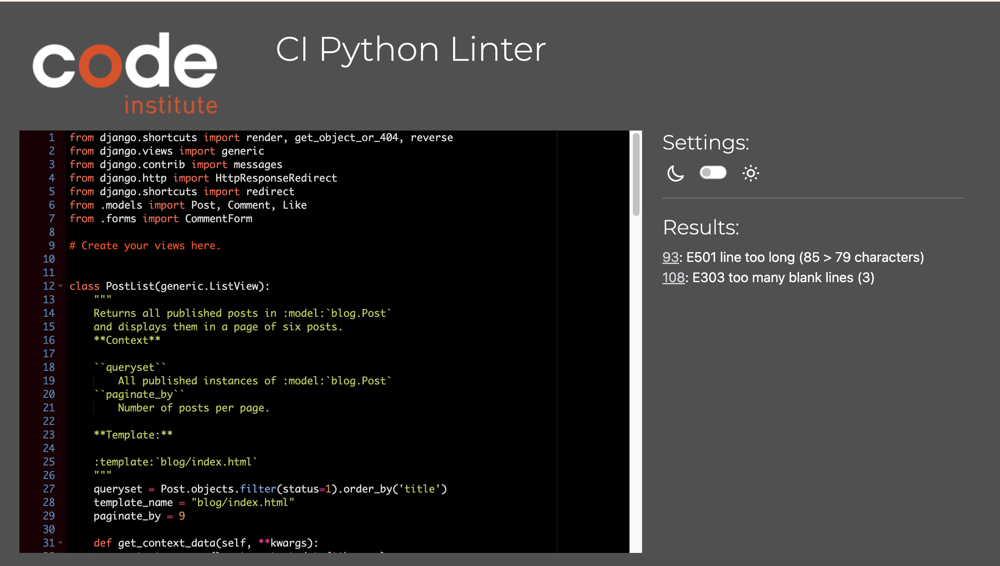

Hey there! Welcome to Sandwich Lab, where we dive into the delicious world of sandwiches. I’m Fabio, a coding enthusiast with a serious passion for culinary adventures. Growing up in Porto, one sandwich always stole the spotlight for me—the Francesinha.

This project is part of my journey in the Code Institute’s Full-Stack Developer course, where I’m focusing on:

- Mastering the Django framework

- Integrating PostgreSQL databases

- Implementing essential CRUD functionalities

So come along and join me as I blend my love for sandwiches and coding, one tasty line at a time!

### Sandwich Lab Homepage

- **Live site**: [Sandwich Lab](https://sandwich-lab-7fc0ba3ca59c.herokuapp.com/)
- **GitHub repository**: [Sandwich Lab GitHub](https://github.com/fabiowxavier/sandwich-lab)

- Test User Log In.

Username : breadmonster

Password : sandwich123

---

## Table of Contents

- [Introduction](#introduction)
- [Overview](#overview)
- [UX - User Experience](#ux---user-experience)
  - [Design Inspiration](#design-inspiration)
  - [Colour Scheme](#colour-scheme)
  - [Font](#font)
- [Project Planning](#project-planning)
  - [Strategy Plane](#strategy-plane)
  - [Site Goals](#site-goals)
  - [Agile Methodologies](#agile-methodologies---project-management)
  - [MoSCoW Prioritization](#moscow-prioritization)
  - [Sprints](#sprints)
  - [User Stories](#user-stories)
  - [Scope Plane](#scope-plane)
  - [Wireframes](#wireframes)
- [Database Schema - ERD](#database-schema---entity-relationship-diagram)
- [Security](#security)
- [Features](#features)
  - [User View - Registered/Unregistered](#user-view---registeredunregistered)
  - [Role-Based Dashboard Features](#role-based-dashboard-features)
  - [Appointment Booking System](#appointment-booking-system)
  - [Messaging System](#messaging-system)
- [Technologies & Languages Used](#technologies--languages-used)
  - [Libraries & Frameworks](#libraries--frameworks)
  - [Tools & Programs](#tools--programs)
- [Testing](#testing)
- [Bugs](#bugs)
- [Deployment](#deployment)
  - [Connecting to GitHub](#connecting-to-github)
  - [Django Project Setup](#django-project-setup)
  - [Heroku Deployment](#heroku-deployment)
- [Privacy Policy](#privacy-policy)
- [Credits](#credits)
- [Acknowledgements](#acknowledgements)

---

## Overview

Sandwich Lab is a platform that allows users to:

- Browse a variety of mouth-watering sandwiches
- Like their favorite sandwiches and see what other users liked
- Leave Comments on different sandwiches
- Check Out what others are saying in their comments

This platform is designed to bring together people who love sandwiches and want to share their creations with the world.

---

## UX - User Experience

### Design Inspiration
The design of **Sandwich Lab** springs from my deep love for the Francesinha and the joy it brings me to share this culinary gem with others. Inspired by the rich flavors and cultural heritage of this iconic sandwich, I envisioned a space where fellow sandwich enthusiasts could explore, discover sandwiches from around the world.

### Colour Scheme
- **Primary Color**: #EC481F
- **Secondary Color**: #4A4A4F;
- **Accent Color**: #EC481F
- **Background**: #F5F0E7 

This combination ensures a vibrant yet clean appearance, matching the food-related theme of the website.

### Font
- **Logo**: Bungee Shade
- **Body Text & Interactive Elements & Headers**: Helvetica Neue

---
*Back to [Table of Contents](#table-of-contents)*

## Project Planning

### Strategy Plane
The primary goal of **Sandwich Lab** s to offer a user-friendly platform for sandwich enthusiasts to discover new sandwiches from around the world. This project aims to share the hidden sandwich gems from every corner of the globe, bringing together a diverse array of flavors and traditions. By creating a space that highlights these unique and delicious sandwiches, we hope to inspire and connect sandwich lovers everywhere.

### Site Goals

#### User Engagement

- Create an intuitive and enjoyable user experience that encourages sandwich enthusiasts to explore and interact with the site.

- Implement features like comments, likes, and sharing options to boost user interaction.

####  Discoverability

- Provide a comprehensive and easily navigable database of sandwiches from around the world.

#### Community Building

- Encourage users to leave comments and reviews, creating a lively exchange of ideas and tips.

#### Educational Content

- Offer detailed descriptions, histories, and recipes for each sandwich to educate users about different cultures and culinary traditions.

#### Visual Appeal

- Ensure the site is visually appealing with high-quality images and a clean, modern design.

Use design elements that reflect the diverse and vibrant nature of sandwiches from different parts of the world.

#### Accessibility

- Make the website accessible to all users, including those with disabilities.

- Follow best practices for web accessibility to ensure everyone can enjoy the content.

Mobile Optimization:

- Optimize the site for mobile devices to ensure a seamless experience for users on the go.

- Ensure that all features are fully functional and visually appealing on smaller screens.

### Agile Methodologies - Project Management
The project was managed using agile methodologies, breaking down the development process into sprints. Tasks were tracked using GitHub’s project board and issues.

All the **could haves** and **won't haves** features are left on the to-do list. These will potentially be tackled in another sprint.

### MoSCoW Prioritization
- **Must-Haves**: User registration and login, posts commenting and like
- **Should-Haves**: Sandwich recipe search functionality, post sharing, improved UI/UX.
- **Could-Haves**: User-generated images for sandwiches, forum like discussion system.
- **Won’t-Haves**: Full payment integration.

### Sprints
1. **Sprint 1**: Set up Django project and environment.
2. **Sprint 2**: User authentication and profile creation.
3. **Sprint 3**: Sandwich blog post creation and comment functionality.
4. **Sprint 4**: UI/UX improvements and search functionality.
5. **Sprint 5**: Deployment and final testing.

### User Stories
- As a **user**, I want to view a paginated list of posts so that I can select which post I want to view.
- As a **user**, I want to click on a post so that I can read the full text.
- As a **user**, I want to view comments on an individual post so that I can read the conversation.
- As a **user**, I want to register an account so that I can comment on a post.
- As a **user**, I want to leave comments on a post so that I can be involved in the conversation.
- As a **user**, I want to modify or delete my comment on a post so that I can be involved in the blog posts
- As a **user**, I want to leave comments and likes for sandwiches.
- As a **user**, I want to fill in a contact form so that I can submit a request for collaboration.
- As an **admin**, I want to approve or disapprove comments so that I can filter out objectionable comments.
- As an **admin**, I want to create draft posts so that I can finish writing the content later.

### Scope Plane
The **Sandwich Lab** platform is designed with essential functionalities to ensure a great user experience. The MVP includes:

#### User Registration and Login

- Users can create an account and log in to access personalized features.

#### Sandwich Details Viewing and Rating

- Users can browse detailed information about various sandwiches.

- Rate sandwiches to share their opinions and help others discover the best ones.

#### CRUD Operations for Sandwich Blog Posts

- Users can create, read, update, and delete blog posts comment about their sandwich experiences and recipes.

### Wireframes
Wireframes were created for the following pages:
- **Home Page**: 

 
Mobile Home Page

   
    
Tablet Home Page

   

Displays a paginated view of featured sandwiches, making it easy for users to browse through a curated selection of sandwich delights.
- **Sandwich Detail Page**: View detailed information about each sandwich recipe.

- **About**: Displays the reason why the web platform was created and includes a collaborative form.

Mobile About Page

Wireframes were designed using **Lucidspark** *.

---
*Back to [Table of Contents](#table-of-contents)*
## Database Schema - ERD

The **Entity Relationship Diagram (ERD)** shows the relationships between **users**, **posts**, **comments**, and **likes**. This is important to visualize how different data points interact within the PostgreSQL database.

Entity Relatioship Diagram were designed using **Lucidchart** *.

---
*Back to [Table of Contents](#table-of-contents)*

## Security

### User View - Registered/Unregistered

**Sandwich Lab** offers distinct user views. Unregistered users can browse through blog posts, but only registered users have full access to the platform's interactive features.

### User Registration Process

- **Users**: Upon registration, users can like and comment on blog posts. They can also create, edit, and delete their own posts, enabling full CRUD (Create, Read, Update, Delete) functionality.
- **Admins**: Admin accounts are created manually by existing admins or superusers within the Django administration area. This process ensures that the creation of administrative-level accounts is strictly controlled.

### Role-Based Dashboard Features

**Sandwich Lab** includes role-based access for different types of users:

- **Registered Users**: Can like and comment on posts, as well as create, edit, and delete their own sandwich blog posts.
- **Admins**: Have the broadest access, including the ability to manage user roles and oversee the entire platform's functionality.

### Role-Based Navigation

The navigation bar in **Sandwich Lab** adapts dynamically based on the user's status:

- **Registered Users**: See options for creating, editing, and deleting posts, as well as liking and commenting on other users' posts.
- **Unregistered Users**: Can browse blog and can see interactive options like liking or commenting.

### Blog Ordering

- **Alphabetical Order**: All blog posts are displayed in alphabetical order, making it easy for users to find specific sandwiches or explore the variety available.

By structuring **Sandwich Lab** this way, we ensure a secure, engaging, and user-friendly environment for all sandwich enthusiasts.

---
*Back to [Table of Contents](#table-of-contents)*

## Features

**Sandwich Lab** offers a range of features designed to provide a delightful and interactive experience for sandwich enthusiasts:

#### User Registration and Login
- **Seamless Registration**: Easy sign-up process for new users to create an account.
- **Secure Login**: Users can securely log in to access personalized features.

#### Viewing and Browsing
- **Sandwich Details Viewing**: Browse through detailed information about various sandwiches, including ingredients.
- **Paginated Viewing**: Browse featured sandwiches through a user-friendly paginated view, ensuring easy navigation of the curated selection.

#### Interaction
- **Liking Posts**: Registered users can like posts to show their appreciation for different sandwich posts.
- **Commenting**: Engage with the community by commenting on sandwich posts, sharing tips and feedback.

#### Content Management

- **Edit and Delete Comments**: Users can edit and delete their own comments, providing full control over their content.
- **CRUD Functionality**: Full Create, Read, Update, Delete operations for comments and likes, ensuring dynamic and up-to-date content.

#### Security Features
- **CSRF Protection**: Protects form submissions from CSRF attacks.
- **Data Encryption**: Encrypts sensitive user data, such as passwords.
- **Role-Based Access Control (RBAC)**: Manages user roles and permissions to restrict access to sensitive areas and functionalities.

#### User-Friendly Design
- **Alphabetical Order**: Blog posts are displayed in alphabetical order, making it easy to navigate and find specific sandwiches.
- **Responsive Design**: The platform is optimized for use on various devices, including desktops, tablets, and smartphones.

### Future Enhancements

**Sandwich Lab** has exciting future features planned to enhance user interaction and engagement:

- **User Profiles**: Planned feature to allow users to create and manage their profiles, showcasing their contributions and interactions.
- **User-Generated Sandwich Posts**: Enable users to post their own sandwich recipes and experiences.
- **Photo Sharing**: Allow users to upload and share pictures of themselves trying out various sandwiches on the blog.
- **Search for Posts**: Implement a search functionality to easily find specific posts.
- **Sort Posts by Date or Popularity**: Allow users to sort posts based on the date they were posted or their popularity.
- **Multilingual Support**: Offer the platform in multiple languages to cater to a global audience.
- **Forum-Like Discussion System**: Create a forum-like space for users to discuss sandwiches, share tips, and ask questions.

By incorporating these features, **Sandwich Lab** aims to create an engaging and interactive platform for all sandwich enthusiasts.

---
*Back to [Table of Contents](#table-of-contents)*

## Technologies & Languages Used

### Technologies Used

**Sandwich Lab** utilizes a variety of technologies to ensure a robust, efficient, and user-friendly platform. Below is a comprehensive list of the technologies and tools used:

#### Python Packages and Libraries
- **asgiref==3.8.1**: Provides ASGI (Asynchronous Server Gateway Interface) support for Django.
- **cloudinary==1.36.0**: Integrates Cloudinary’s cloud storage and image optimization services.
- **crispy-bootstrap5==0.7**: Enhances form rendering with Bootstrap 5 styles.
- **dj-database-url==0.5.0**: Simplifies database configuration using URL strings.
- **dj3-cloudinary-storage==0.0.6**: Enables Django to use Cloudinary for static and media file storage.
- **Django==4.2.16**: The main web framework used to build and manage the application.
- **django-allauth==0.57.2**: Provides comprehensive user authentication, registration, and account management.
- **django-cloudinary-storage==0.3.0**: Another package for integrating Cloudinary storage with Django.
- **django-crispy-forms==2.3**: Improves the rendering of forms with additional layout and styling capabilities.
- **django-summernote==0.8.20.0**: Adds a WYSIWYG editor for richer text formatting in forms.
- **gunicorn==20.1.0**: A Python WSGI HTTP Server for deploying the application.
- **oauthlib==3.2.2**: A generic, spec-compliant, and thorough implementation of the OAuth request-signing logic.
- **pillow==11.0.0**: A Python Imaging Library that adds image processing capabilities.
- **psycopg2==2.9.10**: A PostgreSQL adapter for Python, allowing integration with PostgreSQL databases.
- **PyJWT==2.10.1**: Enables JWT (JSON Web Token) handling for secure authentication.
- **python3-openid==3.2.0**: Provides OpenID support for single sign-on authentication.
- **requests-oauthlib==2.0.0**: Integrates OAuth for secure API access.
- **sqlparse==0.5.2**: A non-validating SQL parser for Python.
- **urllib3==1.26.20**: A powerful HTTP library for Python.
- **whitenoise==5.3.0**: Serves static files efficiently in Django applications.

#### Frontend Technologies
- **HTML**: Structures the web content.
- **CSS**: Styles the web content for a visually appealing design.
- **Bootstrap**: Provides responsive design and pre-built components for a modern UI.

#### Development and Deployment Tools
- **Lucidchart**: Used for creating the ERD and Wireframes to plan the project.
- **ChatGPT**: Leveraged for generating content, obtaining coding assistance, and debbuging. 
- **Bing**: Utilized for web searches and research.
- **GitHub**: Version control and collaboration platform for managing the codebase.
- **GitPod**: An online IDE for coding and debugging.
- **Heroku**: A cloud platform for deploying and hosting the application.

By integrating these technologies, **Sandwich Lab** ensures a seamless and efficient experience for users and developers alike.

---
*Back to [Table of Contents](#table-of-contents)*

## Testing

### Validation Testing
- **HTML**: W3C HTML Validator.

- **CSS**: W3C CSS Validator.

- **JavaScript**: JsHint validatior.

All the warnings found are related to browser extentions.

- **Python**: CI Python Linter Validator.

The file with the E501 and E303 error were all automatically generated by Django.

Blog/Views

About/Views

- **Django**: Automated test.

### User Testing
- **Browser Compatibility**: Tested across Chrome, Firefox, Safari.
- **Responsiveness**: Ensured that the site works on mobile, tablet, and desktop.

### User Tests

| Test                                         | Result |
|----------------------------------------------|--------|
| Create user account                          | Pass   |
| Log in                                       | Pass   |
| Log out                                      | Pass   |
| Superuser can access admin page              | Pass   |
| Non Superusers cannot access admin page      | Pass   |
| Users cannot Like or comment if not logged in | Pass   |

### Task Tests

| Test                                             | Result |
|--------------------------------------------------|--------|
| User can add a comment                              | Pass   |
| User can edit a comment                             | Pass   |
| User can delete a comment                           | Pass   |
| User can like and unlike any post  | Pass   |
| User can can send a collaborative form logged in   | Pass   |
| User can can send a collaborative form logged out   | Pass   |

---

## Bugs

### Bug Fix #1: Incorrect Image Upload Path

**Issue:**
Images uploaded by users were not being saved to the correct path, causing broken image links on the site.

**Cause:**
- The file path configuration in the Django settings was incorrect.

**Steps Taken to Fix:**
1. Reviewed and corrected the `MEDIA_URL` and `MEDIA_ROOT` settings in `settings.py`.
2. Verified that uploaded images are saved to the correct directory.

**Outcome:**
Images are now being uploaded and saved to the correct path, ensuring that they display properly on the site.

### Bug Fix #2: Commenting System Malfunction

**Issue:**
Registered users were unable to post comments on blog posts due to a malfunction in the commenting system.

**Cause:**
- The issue was traced to a missing form validation step in the commenting view.

**Steps Taken to Fix:**
1. Reviewed and corrected the form validation logic in the commenting view.
2. Tested the commenting functionality to ensure users could post comments without issues.

**Outcome:**
The commenting system now works correctly, allowing registered users to post and view comments on blog posts.

### Bug Fix #3: Pagination Not Working

**Issue:**
The pagination on the blog was not functioning, causing all blog posts to be displayed on a single page.

**Cause:**
- There was a misconfiguration in the pagination settings and view logic.

**Steps Taken to Fix:**
1. Reviewed and corrected the pagination settings in the views.
2. Ensured the pagination controls are correctly implemented in the templates.

**Outcome:**
Pagination now works as intended, displaying a manageable number of posts per page.

### Bug Fix #4: User Registration Signal Not Triggering

**Issue:**
A Django signal intended to handle additional actions upon user registration was not being triggered.

**Cause:**
- The signal handler was not properly connected in the `ready()` method of the app config.

**Steps Taken to Fix:**
1. Correctly configured the signal handler in the `ready()` method of `apps.py`.
2. Ensured that the signal is properly connected and triggered upon user registration.

**Outcome:**
The signal now triggers correctly, performing the required actions upon user registration.

### Bug Fix #5: Inconsistent Post Sorting

**Issue:**
Blog posts were not being sorted consistently, leading to a confusing user experience.

**Cause:**
- The sorting logic in the views was not correctly implemented.

**Steps Taken to Fix:**
1. Reviewed and corrected the sorting logic in the blog post views.
2. Ensured that posts are sorted in alphabetical order as intended.

**Outcome:**
Blog posts are now consistently sorted in alphabetical order, improving the user experience.

### Bug Fix #6: Comment Editing Issue

**Issue:**
Users were unable to edit their comments after posting. The edited comment did not populate properly in the text box and updating it resulted in duplicated comments.

**Cause:**
- The form handling for editing comments was incorrect, causing issues with data population and duplication.

**Steps Taken to Fix:**
1. Reviewed and corrected the form handling logic for comment editing.
2. Ensured that the existing comment data is correctly populated in the text box for editing.
3. Fixed the duplication issue by correcting the update logic.

**Outcome:**
While the comments can now be posted, the editing functionality still requires further refinement to fully resolve the issue.

---
*Back to [Table of Contents](#table-of-contents)*

## Deployment

### Connecting to GitHub
The project was connected to GitHub for version control and was deployed using Heroku. The necessary steps for deployment include configuring the `Procfile`, setting up environment variables, and using Git for version control.

- **GitHub repository**: [Sandwich Lab GitHub](https://github.com/fabiowxavier/sandwich-lab)

### Heroku Deployment
- Deployed to Heroku by connecting the GitHub repository and configuring necessary environment variables such as `DATABASE_URL`, `CLOUDINARY_URL`, and `SECRET_KEY`.

- **Live site**: [Sandwich Lab](https://sandwich-lab-7fc0ba3ca59c.herokuapp.com/)

---
*Back to [Table of Contents](#table-of-contents)*

## Privacy Policy
As part of this project, user data such as registration details and sandwich submissions are securely stored, with role-based access ensuring the privacy of personal information. The platform does not share personal data with third parties.

---
*Back to [Table of Contents](#table-of-contents)*

## Credits

### Code
- **Django Documentation**: For guidance on using Django's features and functionalities.
- **ChatGPT AI**: For code ideas and implementation suggestions.
- **Bootstrap**: For the website layout and responsive design components.
- **Google Fonts**: For typography and font styles.
- **Stack Overflow**: For troubleshooting and solutions to coding challenges.
- **MDN Web Docs**: For detailed web development references and tutorials.

### Media
- **Icons**: From FontAwesome.
- **Images**: Sourced from various Google search locations.
- **Sandwich Content**: Taken from [Thrillist: Best Sandwiches Around the World](https://www.thrillist.com/eat/nation/best-sandwiches-types-around-the-world). *(Please note that this content is not used for commercial purposes, but solely for production and to showcase accurate content.)*
- **Cloudinary**: For image hosting and management services.

### Tools and Platforms
- **GitHub**: For version control and collaborative development.
- **GitPod**: For the online IDE used for coding and debugging.
- **Heroku**: For deploying and hosting the application.
- **Lucidchart**: For creating Wireframes and diagrams to plan the project.
- **Bing**: For web searches and research.
- **TechSini**: For different devices show casing. 
- **CI Python Linter**: Automatically checks Python code for errors, ensuring PEP8 compliance.
- **W3C HTML & CSS Validator**: Validates HTML and CSS against web standards to maintain quality and compatibility. 
- **JSHint Validator**: Detects errors and potential issues in JavaScript, enforcing best practices.

---
*Back to [Table of Contents](#table-of-contents)*

## Acknowledgments

I want to give a huge shout-out to my amazing wife, Adele, for all the support throughout this course and the projects that led to this one. Her encouragement and belief in me have been absolutely invaluable.

A big thank you also goes to **Code Institute** for providing the resources and environment that made this project possible. Their comprehensive curriculum and supportive community have played a crucial role in my development as a developer. Special thanks to the tutor team for their invaluable help in finding solutions to a few bugs I was struggling to solve.

Lastly, a big up to **Headforwards** for their support and sponsorship of the first Cornish cohort. Their backing has been instrumental in making this journey a reality.

---
*Back to [Table of Contents](#table-of-contents)*
